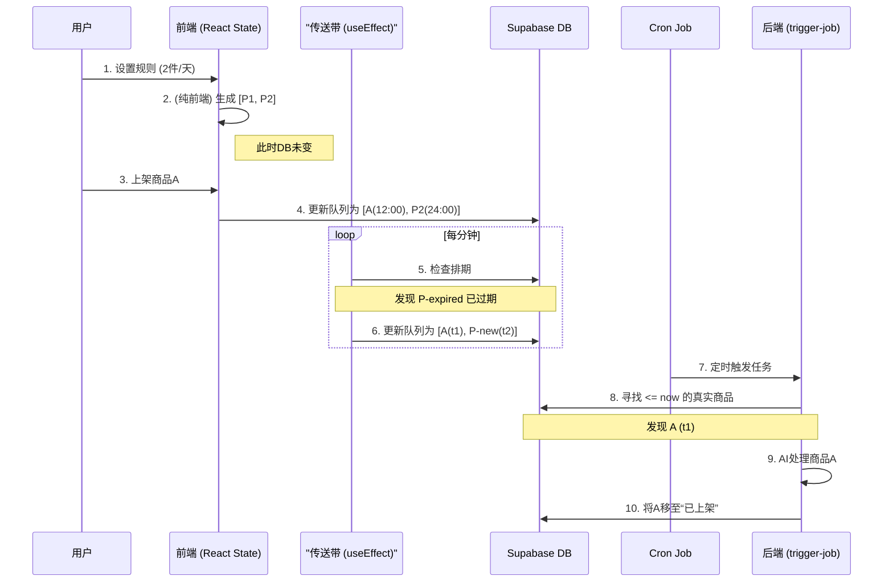
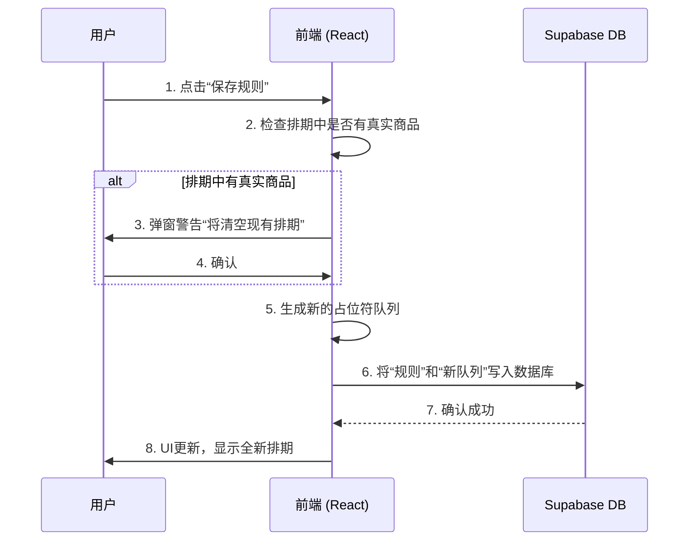

 
# 技术文档：上架计划 (Listing Plan)

## 1. 核心思想：传送带 (Conveyor Belt) 模型

本项目最核心的机制是“传送带”模型。您可以将其想象成一条持续向未来滚动的传送带，上面有固定数量的“托盘”（即排期）。

*   **数量恒定**: 传送带上的托盘总数（由“每日上架数量”规则定义）永远不变。
*   **无限滚动**: 当时间流逝，一个托盘从传送带的头部掉落（即任务时间已过），系统会自动在传送带的尾部补充一个新的空托盘。
*   **萝卜坑**: 每个托盘就是一个“萝卜坑”。它可以是空的（`isPlaceholder: true`），等待真实商品放入；也可以被真实商品占据。
*   **前端即仪表盘**: 用户界面是这个传送带的仪表盘，实时显示未来24小时内所有托盘的状态（是空是满，以及预计到达时间）。

这个模型保证了上架节奏的绝对稳定和无限持续。

---

## 2. 前端交互与状态管理 (`page.tsx`)

前端使用 React 和 State Management 来驱动所有用户交互，并实现了部分操作的“前端优先”，以提供流畅体验。

#### 2.1 规则设置与重置 (纯前端操作)

这是一个关键改动点：**设置规则和重置排期是纯前端的“预览”操作，不会立即写入数据库。**

*   **`handleSaveRule` (保存规则)**:
    1.  当用户在设置中保存“每日上架数量”时，此函数被触发。
    2.  它**只在浏览器中**清空当前账户的待上架队列。
    3.  然后，它根据新规则（例如每天4个），从当前时间（+10分钟缓冲）开始，计算出所有未来时间点，并生成一套全新的“空托盘”（占位符）。
    4.  这个新生成的排期**仅更新前端React状态**，让用户可以立刻看到新的排期计划。
    5.  只有规则本身（例如 `items_per_day: 4`）会被保存到数据库，而新生成的占位符队列则不会。

*   **`handleResetSchedule` (重置排期)**:
    1.  逻辑与 `handleSaveRule` 完全相同。
    2.  它会读取当前已保存的规则，并**仅在前端**生成一套全新的、干净的占位符排期。

#### 2.2 上架：填充空位 (`handleDeployProduct`)

这是将真实商品放入传送带“空托盘”的过程。

1.  **扫描队列**: 当用户投放一个商品时，系统会扫描该账户的待上架队列。
2.  **寻找空位**: 寻找第一个 `isPlaceholder: true` 的占位符。
3.  **填充**: 将真实商品的ID放入该托盘，并**完全继承该托盘原有的 `scheduled_at` 时间戳**。
4.  **更新数据库**: 此操作会**触发数据库写入**，将更新后的整个队列保存到Supabase。

#### 2.3 删除：留坑或滚动 (`handleDeleteItemFromArray`)

删除操作会根据对象的不同触发不同的“传送带”逻辑。

1.  **删除真实商品（留坑）**: 如果用户删除的是一个已排期的真实商品，该商品所在的“托盘”**不会被移除**。它会自动变回一个空的占位符，但**保留原有的时间戳**，等待新的商品来填充。此操作会**更新数据库**。
2.  **删除占位符（滚动）**: 只有当用户删除一个占位符时，传送带才会“滚动”。
    *   系统会移除这个占位符。
    *   然后立即在队列的**末尾补充一个新的占位符**。
    *   新占位符的时间戳，会根据队尾最后一个任务的时间和规则间隔计算得出。
    *   此操作会**更新数据库**，确保队列总长度不变。

#### 2.4 “传送带”自动滚动 (`useEffect` Hook)

这是实现无限滚动的核心。

1.  **定时检查**: `page.tsx` 中有一个 `useEffect` hook，它每分钟执行一次。
2.  **扫描所有账户**: 它会遍历所有账户的 `todays_schedule`。
3.  **清理过时的占位符**: 找到所有 `scheduled_at` 时间早于当前时间的 **占位符 (Placeholder)**。**关键：它不会触碰已过期的真实商品**，那些任务必须由后端 `trigger-job` 来处理。
4.  **补充新任务**: 每清理一个过时占位符，它就会在队列末尾计算并添加一个新的占位符，以维持总数不变。
5.  **更新数据库**: 如果发生了滚动（有占位符被清理和补充），这个 `useEffect` hook 会将更新后的队列**保存到数据库**。

---

## 3. 后端自动化任务 (`trigger-job`)

后端任务是传送带的“卸货员”，它只负责处理传送带最前端的那个**已填充的**托盘。

**API Endpoint:** `GET /api/trigger-job`

#### 3.1 核心处理流程

1.  **获取激活的账户**: 同旧版，获取所有 `scheduling_rule->>enabled: true` 的账户。
2.  **锁定与遍历**: 同旧版，使用 `automation_runs` 表作为锁，依次处理账户。
3.  **寻找待办任务**:
    *   它会扫描账户的 `待上架` 队列，寻找第一个**时间已到或已过期** (`scheduled_at <= now`) 的任务。
    *   **关键条件**: 如果这个任务是**真实商品**（`isPlaceholder: false`），则将其作为本次要处理的目标。
    *   如果时间到了，但最前端的任务依然是个占位符，后端任务**不会**做任何事，直接跳过，等待用户从前端去填充它。
4.  **AI处理与上架**:
    *   一旦找到待办的真实商品，后端会执行完整的AI文案生成、AI图片生成、上传图片等一系列操作。
5.  **更新数据库**:
    *   **更新商品**: 将AI生成的内容更新回 `search_results_duplicate_本人` 表。
    *   **更新队列**: 从 `待上架` 队列中移除这个已被处理的商品，并将其信息添加到 `已上架json` 队列中。**注意：后端的 `trigger-job` 不负责补充新占位符，这个工作由前端的“传送带”`useEffect` hook完成。**
6.  **释放锁与记录日志**: 同旧版。

---

## 4. 数据流与时序图 (最终版)


```

---

## 5. 关键代码逻辑修改

为实现上述流程，对前端代码进行了以下关键修改：

*   **`useEffect` (传送带滚动)**:
    *   修改了过滤逻辑，现在只移除 `isPlaceholder: true` 且时间已过的任务。
    *   这可以防止前端意外删除一个后端尚未处理的、已到期的真实商品。

*   **`handleSaveRule` & `handleResetSchedule` (规则保存与重置)**:
    *   **增加用户警告**: 在执行前，会检查当前排期中是否存在真实商品。如果存在，会弹窗警告用户此操作将清空现有排期。
    *   **同步数据库**: 这两个操作现在会将新生成的“空托盘”队列**直接写入数据库**的 `待上架` 字段。这确保了前端UI与数据库状态的绝对一致，避免了刷新页面后数据不一致的问题。



```