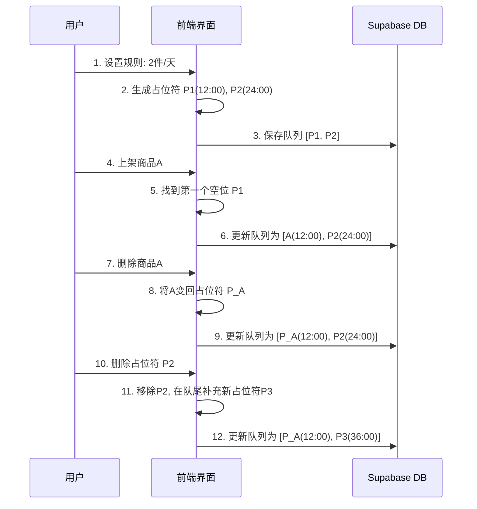

# 技术文档：上架计划 (Listing Plan)

## 1. 概述

“上架计划”是一个自动化系统，旨在根据预设的规则，定时为不同“账户”（店铺）发布新产品。该系统由两部分组成：

*   **前端配置界面**：允许用户为每个账户设置每日上架商品数量、查看和管理待上架队列。
*   **后端自动化任务**：一个由 Cron Job 调度的 Serverless Function，负责在后台执行实际的上架逻辑。

本文档将重点阐述其核心业务逻辑和技术实现。

## 2. 核心组件：后端上架任务 (`trigger-job`)

后端任务是整个上架计划的中枢。它是一个通过 `GET` 请求触发的 API 路由，设计为由定时任务（如 Vercel Cron Job）定期调用。

**API Endpoint:** `GET /api/trigger-job`

#### 2.1 任务触发与认证

*   **触发方式**：该 API 端点预期由一个外部的定时任务服务（Cron Job）通过发送 `GET` 请求来触发。
*   **安全认证**：为了防止未经授权的访问，任务在执行前会验证请求头中的 `authorization` 字段。该字段的值必须是 `Bearer ${CRON_SECRET}`，其中 `CRON_SECRET` 是一个存储在环境变量中的密钥。如果认证失败，将返回 `401 Unauthorized` 错误。

#### 2.2 核心处理流程

任务一旦被成功触发，将执行以下一系列操作：

1.  **启动日志记录**: 为本次任务创建一个唯一的 `runId`，后续所有日志都将与此 ID关联，便于追踪和调试。
2.  **获取待处理账户**: 从 Supabase 数据库的 `accounts_duplicate` 表中，查询所有 `scheduling_rule->>enabled` 字段为 `true` 的账户。这意味着任务只会处理已启用“上架计划”的账户。
3.  **遍历并处理每个账户**: 系统会依次处理每个符合条件的账户。为了防止并发执行导致的数据冲突，任务会为每个账户设置一个“锁”（通过在 `automation_runs` 表中插入一条记录）。如果“锁”已存在，则跳过该账户，并记录一条警告日志。
4.  **“库存”检查 (Keep One in Stock)**:
    *   在处理一个账户前，系统会优先检查其“待上架”队列 (`待上架` 字段)。
    *   **核心规则**: 如果队列中已存在任何**真实商品**（非占位符），则立即停止处理当前账户。这是为了确保队列中始终只有一个真实商品待处理，避免积压。
5.  **寻找并填充“占位符”**:
    *   如果队列中没有真实商品，任务会寻找第一个“占位符” (`isPlaceholder: true`)。占位符是在前端设置上架规则时自动生成的，代表一个未来的上架时间点。
    *   如果找不到占位符，说明当天的上架额度已满或未设置，任务将跳过该账户。
6.  **选择新商品**:
    *   找到占位符后，任务会从 `search_results_duplicate_本人` 表中，为该账户选择一个**从未被使用过**的新商品。
    *   “使用过”的商品 ID 会从所有账户的“待上架”和“已上架”队列中收集，确保不会重复上架。
7.  **AI 内容生成与处理**:
    *   **文案生成**: 使用与账户关联的 "文案生成prompt" 和新选出商品的原有文本，通过调用 Gemini API (`gemini-1.5-flash`) 生成新的、经过优化的商品文案。
    *   **图片生成**: 使用新生成的文案，调用 `generateImageBufferFromText` 和 `uploadImageToSupabase` 函数，生成一张新的商品图片并上传至 Supabase Storage。
8.  **更新数据库**:
    *   **更新商品信息**: 将 AI 生成的新文案和图片 URL 更新回 `search_results_duplicate_本人` 表中对应的商品记录。
    *   **替换占位符**: 在账户的“待上架”队列中，用这个包含了新商品 ID 和**原占位符预定时间**的真实商品对象，替换掉之前的占位符。**这一点至关重要，它保证了商品会按照最初规划的时间上架。**
9.  **释放锁并记录日志**:
    *   处理完一个账户后，会从 `automation_runs` 表中删除对应的记录，即“释放锁”。
    *   整个流程中的关键步骤都会被详细记录到 `automation_logs` 表中，包括成功、警告和错误信息。
10. **任务结束**: 所有账户处理完毕后，记录一条最终的成功日志，并返回 `200 OK` 响应。

---
### 3. 前端交互与配置 (`page.tsx` & `AccountListView.tsx`)

前端的核心是“萝卜坑”式的占位符模型，它确保了上架节奏的稳定性和可预见性。

#### 3.1 规则设置与重置

*   **设置规则 (`handleSaveRule`)**: 用户在“高级设置”中定义“每日上架数量”。保存后，系统会清空现有队列，并从当前时间开始，根据数量和24小时间隔，生成一整套全新的、带准确时间戳的“待定商品”占位符。
*   **重置排期 (`handleResetSchedule`)**: 用户可以随时点击“重置排期”按钮，该操作会清空当前所有排期（包括真实商品），并重新执行一遍“设置规则”的逻辑，生成一套全新的占位符队列。

#### 3.2 上架：填充空位 (`handleDeployProduct`)

当用户从商品列表页投放一个商品时，系统会执行“填充空位”逻辑：
1.  **扫描队列**: 系统会从头到尾扫描该账户的“待上架”队列。
2.  **寻找空位**: 寻找第一个 `isPlaceholder: true` 的“待定商品”空位。
3.  **填充**: 将用户选择的真实商品放入该空位，并**完全继承该空位原有的 `scheduled_at` 时间戳**。
4.  **队列已满**: 如果扫描完成都找不到任何空位，则会提示用户“排期已满”。

#### 3.3 删除：留坑或滚动 (`handleDeleteItemFromArray`)

删除操作根据删除对象的类型，有两种不同行为：
1.  **删除真实商品（留坑）**: 如果用户删除的是一个已排期的真实商品，该商品所在的“坑”**不会被移除**。它会自动变回一个“待定商品”占位符，但**保留原有的时间戳**，等待新的商品来填充。
2.  **删除占位符（滚动）**: 只有当用户删除一个“待定商品”占位符时，队列才会“滚动”。系统会移除这个占位符，并立即在队列的**末尾补充一个新的占位符**，其时间戳会根据队尾最后一个任务的时间和上架间隔计算得出，确保队列总长度不变。

### 4. 数据流与时序图 (最终版)

